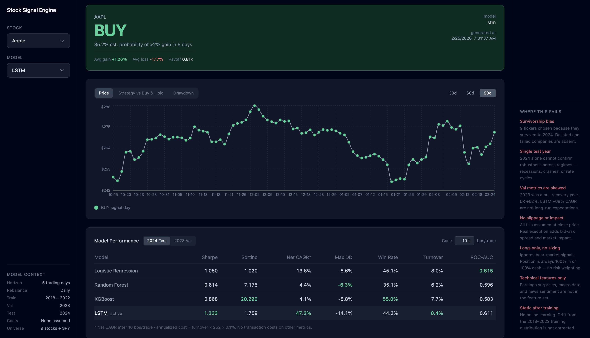

# Stock Signal Engine

An end-to-end ML system that ingests real stock market data, engineers predictive features, trains and tracks multiple models, and serves buy/hold signals through a REST API with a React dashboard.

The emphasis is on **ML system design** — not just a model in a notebook, but a production-style pipeline with proper data handling, experiment tracking, and a deployable API.



---

## Architecture

```
yfinance API
     │
     ▼
src/data/ingest.py          Download OHLCV data → data/raw/<TICKER>.csv
     │
     ▼
src/data/features.py        Feature engineering → data/processed/<TICKER>.csv
     │
     ▼
src/models/train.py         Train 4 model families, log all runs to MLflow
     │
     ▼
src/models/evaluate.py      Metrics + backtested Sharpe on held-out test set
     │
     ▼
api/main.py (FastAPI)       Serve signals, history, and model performance
     │
     ▼
frontend/ (React + Vite)    Dashboard — signal card with expected value stats, price/returns/drawdown chart, model comparison table with val/test toggle and cost adjuster, limitations sidebar
```

---

## Tech Stack

| Layer | Tools |
|---|---|
| Data | yfinance, pandas, ta |
| ML | scikit-learn, XGBoost, PyTorch |
| Experiment tracking | MLflow |
| API | FastAPI, uvicorn, Pydantic |
| Frontend | React, Vite, Tailwind CSS, recharts |
| Infrastructure | Docker, docker-compose |

---

## Setup

```bash
# Backend
python3 -m venv .venv && source .venv/bin/activate
pip install -r requirements.txt

# Frontend
cd frontend && npm install
```

---

## Running the Pipeline

```bash
# 1. Download OHLCV data for all tickers (skips if already cached)
python -m src.data.ingest

# 2. Feature engineering
python -m src.data.features

# 3. Train all models (logs to MLflow)
python -m src.models.train

# 4. Evaluate on held-out test set
python -m src.models.evaluate

# 5. Inspect all runs visually
mlflow ui

# 6. Export best model artifacts to models/
python -m src.models.export

# 7. Start the API
uvicorn api.main:app --reload

# 8. Start the React dashboard (in a separate terminal)
cd frontend && npm run dev
```

---

## API Endpoints

| Method | Path | Description |
|---|---|---|
| GET | `/health` | Server status and loaded model names |
| GET | `/signal/{ticker}?model=` | Current BUY/HOLD signal for a ticker |
| GET | `/history/{ticker}?days=&model=` | OHLCV + signals for last N trading days (20–365) |
| GET | `/models/performance` | Test-set (2024) and val-set (2023) metrics for all 4 models |

`model` parameter accepts: `logistic_regression`, `random_forest`, `xgboost`, `lstm` (default: `logistic_regression`)

---

## Tickers

AAPL, MSFT, GOOGL, AMZN, TSLA, NVDA, META, JPM, SPY

Training window: 2018–2022 · Validation: 2023 · Test: 2024

---

## Model Results (Test Set — 2024, no transaction costs)

| Model | ROC-AUC | Sharpe | CAGR | Avg gain | Avg loss | Payoff |
|---|---|---|---|---|---|---|
| Logistic Regression | 0.615 | 1.050 | 15.6% | +1.57% | −1.17% | 1.28× |
| LSTM | 0.611 | 1.233 | 47.3% | +1.26% | −1.17% | 0.81× |
| XGBoost | 0.583 | 0.868 | 6.0% | +1.47% | −1.23% | 1.40× |
| Random Forest | 0.596 | 0.614 | 6.0% | +1.05% | −0.85% | 3.02× |
| Buy-and-hold baseline (SPY) | — | 1.913 | — | — | — | — |

Avg gain/loss and payoff are per active (BUY) trading day on the test set, averaged across all 9 tickers.

### A note on predictive power

These models have modest predictive signal — ROC-AUC of 0.61 is meaningfully above random (0.5) but far from strong. This is expected. Stock price direction from public OHLCV data and standard technical indicators is one of the hardest prediction problems in existence; academic literature consistently reports similar ranges for this feature set.

**The point of this project is not to beat the market.** It is to demonstrate the full engineering discipline of an ML system:

- Lookahead bias prevention — all features use `.shift(1)` before joining with the target
- Strict chronological train/val/test splits — no random shuffling of time-series data
- Scaler fit on training data only, applied to val and test
- Class imbalance handled with `class_weight='balanced'`
- Model selection by ROC-AUC on the validation set
- Decision threshold tuned on validation set (LSTM), never on test
- Backtesting with Sharpe ratio, not just classification accuracy
- Full experiment tracking via MLflow across all model families and hyperparameter sweeps

---

## Deployment

The project is deployed end-to-end:

- **Backend API:** [https://stock-signal-engine.duckdns.org](https://stock-signal-engine.duckdns.org)
  AWS EC2 t3.micro · Docker Compose (FastAPI + nginx) · Let's Encrypt SSL
- **Frontend:** [https://stock-signal-engine.vercel.app](https://stock-signal-engine.vercel.app)
  Vercel · `VITE_API_BASE` points to the EC2 backend

### Docker (local or production)

```bash
# Build and start API + nginx
docker-compose up --build

# API is exposed at :8000 inside the container; nginx proxies :80/:443 → api:8000
```

Key deployment files:

| File | Purpose |
|---|---|
| `Dockerfile` | Builds FastAPI image from `requirements-api.txt`; uses CPU-only PyTorch to fit on a t3.micro |
| `docker-compose.yml` | Two services: `api` (FastAPI) and `nginx` (reverse proxy + SSL termination) |
| `nginx.conf` | HTTP → HTTPS redirect; proxies to `api:8000`; references Let's Encrypt certs |
| `requirements-api.txt` | API-only deps (no MLflow, jupyter, matplotlib); keeps the image under 1 GB |

---

## Project Structure

```
stock-signal-engine/
├── data/
│   ├── raw/                  OHLCV CSVs from yfinance (gitignored)
│   └── processed/            Feature-engineered CSVs (gitignored)
├── src/
│   ├── data/
│   │   ├── ingest.py
│   │   └── features.py
│   ├── models/
│   │   ├── train.py
│   │   ├── evaluate.py
│   │   ├── export.py
│   │   └── lstm.py
│   └── backtest/
│       └── strategy.py
├── api/
│   ├── main.py               App entry point; loads all model artifacts at startup
│   ├── schemas.py            Pydantic response models
│   └── routers/
│       ├── signal.py         GET /signal/{ticker}, GET /history/{ticker}
│       └── performance.py    GET /models/performance
├── frontend/
│   ├── src/
│   │   ├── App.jsx           Root component; state + data fetching; three-column layout
│   │   ├── lib/api.js        fetch wrappers for all API endpoints
│   │   └── components/       SignalCard, PriceChart, ModelComparison, Dropdown, Limitations
│   └── package.json
├── models/                   Exported model artifacts (ships with repo)
├── tests/
│   └── test_api.py           Integration tests (20 tests; requires server on :8000)
├── mlruns/                   MLflow tracking (gitignored)
├── Dockerfile
├── docker-compose.yml
├── nginx.conf
├── requirements-api.txt      API-only deps for Docker image
└── requirements.txt
```
